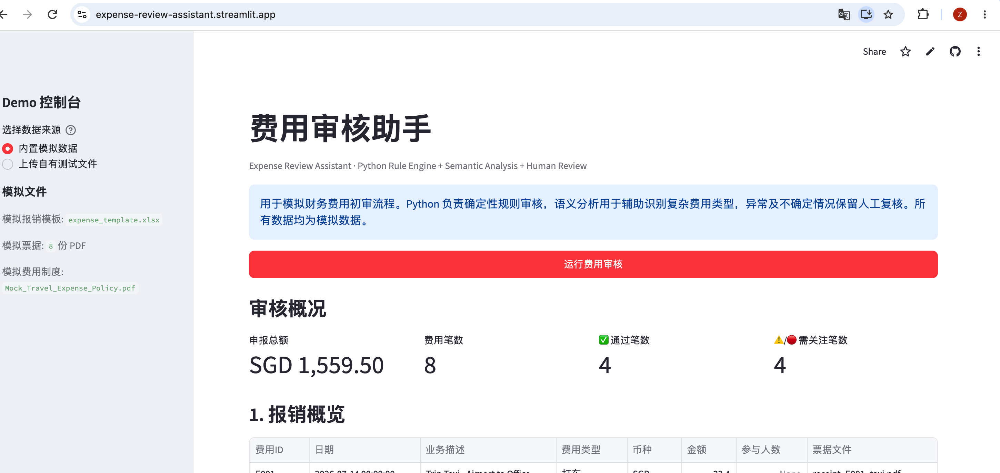

# 费用审核助手

## Expense Review Assistant

面向费用初审场景，通过 Python 固化确定性审核规则，并结合语义辅助分析、管理报表科目映射与人工复核，提高费用处理效率。

[🌐 在线 Demo（待补充）](#在线-demo) · [💻 GitHub Repository](https://github.com/Joyhanz-bot/Expense-Review-Assistant)

> **截图占位**：当前仓库尚未包含正式页面截图，未生成假截图。请将主页面截图放入 `screenshots/overview.png`。
>
> 

## 1. 项目简介

这是一个模拟财务费用初审工作流的 Streamlit 工具。它将报销 Template、PDF 票据和模拟费用制度统一纳入审核流程，先由 Python 完成可解释的确定性校验，再对复杂费用描述进行语义辅助分析，最后把异常和不确定情况交给财务人员复核。

项目不自动作出最终财务审批，也不把 LLM 当作规则引擎使用。重点是展示一套边界清晰、便于追溯的 Finance × AI 工作流。

## 2. 业务背景

实际费用审核通常同时面对模板字段、票据字段、金额币种、日期、人数和费用制度等多类信息。确定性检查适合由程序稳定执行，而“这张票据到底属于什么费用”或“一张票据是否混合了多种费用性质”等问题，往往需要结合文本语义和人工判断。

本项目将两类问题分开处理：规则能确定的内容由 Python 判断；语义不充分、混合费用或低置信度记录保留 Human Review。

## 3. 核心流程

```text
上传报销 Template + PDF 票据
        ↓
票据文本解析与字段提取
        ↓
Python Rule Engine
        ↓
审核结果与异常原因
        ↓
仅对通过项生成管理报表科目打标建议
        ↓
异常 / 不确定项进入 Human Review
        ↓
财务人员最终确认
```

## 4. 核心功能

- 解析 PDF 票据中的金额、币种、日期和描述等基础字段。
- 校验报销金额、币种、日期、票据存在性和附件匹配关系。
- 检查住宿晚数、住宿标准、餐饮标准、客户招待人均标准和加班打车时间规则。
- 对费用描述进行本地语义分类，识别 Taxi、Hotel、Meal、Client Entertainment、Mixed Expense 等类别。
- 对审核通过的记录生成管理报表科目路径建议。
- 将规则异常、信息缺失、Mixed Expense 和低置信度记录集中展示，便于 Human Review。

## 5. 关键业务逻辑

### Python Rule Engine

Python 负责所有可以稳定、确定性判断的审核逻辑，包括：

- 金额核验与币种核验。
- 报销日期、出差日期和票据日期核验。
- 住宿晚数与住宿标准判断。
- 餐饮标准和客户招待人均人数校验。
- 加班打车时间规则。
- 模板字段、票据字段、票据存在性和附件文件名匹配。
- 缺失字段检查及明确可识别的异常。

### Management Reporting Mapping

只有审核结果为“建议通过”的记录才生成建议打标科目。当前模拟映射示例：

- 打车 → `行政费用 > 差旅费 > 出租车/打车费`
- 加班打车 → `行政费用 > 差旅费 > 加班打车费`
- 餐饮 → `行政费用 > 差旅费 > 出差餐饮费`
- 客户招待 → `业务招待费`
- 住宿 → `行政费用 > 差旅费 > 短期出差住宿` 或 `长期出差住宿`

住宿长短期使用住宿晚数或出差时长判断。当前 Demo 采用 7 晚及以下为短期、超过 7 晚为长期的模拟管理口径，实际企业使用时应根据制度调整。以上均为系统建议，最终由财务人员确认。

### Semantic Analysis

当前公开 Demo 默认使用本地关键词规则进行语义分类，不依赖付费外部 LLM API。项目在 `src/semantic_analyzer.py` 中预留了 LLM 接口；如配置 `OPENAI_API_KEY`，可按需测试外部模型调用，但模型只负责辅助理解票据文本，不负责最终审批。

Mixed Expense、低置信度或语义无法稳定判断的记录必须进入 Human Review。

## 6. Python / Semantic Analysis / Human Review 的职责边界

| 模块 | 负责内容 |
| --- | --- |
| Python Rule Engine | 确定性财务规则、字段核验、异常识别、科目 Mapping |
| Semantic Analysis | 费用性质、复杂描述、Mixed Expense 和语义置信度辅助判断 |
| Human Review | 处理规则异常、信息缺失和语义不确定记录，并完成最终确认 |

本工具只提供初审建议，不执行最终财务审批。

## 7. Demo 截图

请将正式截图放入 `screenshots/` 后替换以下占位文件：

| 截图 | 说明 |
| --- | --- |
| `screenshots/overview.png` | 审核结果总览：快速区分通过、规则异常和需人工复核记录。 |
| `screenshots/reporting_mapping.png` | 管理报表打标建议：对审核通过项生成建议科目路径。 |
| `screenshots/human_review.png` | 人工复核区域：直接查看原始申报、票据和核心处理建议。 |

## 在线 Demo

> 当前未在仓库部署记录或 README 中发现可验证的 Streamlit 公网地址。请部署后将链接补充到顶部“在线 Demo”入口。

## 8. 项目结构

```text
expense-review-assistant/
├── app.py                  # Streamlit 页面与交互流程
├── src/
│   ├── rule_engine.py      # Python 确定性审核规则
│   ├── receipt_parser.py   # PDF 票据文本和字段提取
│   ├── semantic_analyzer.py # 本地语义分类与可选 LLM 接口
│   ├── reporting_mapper.py # 管理报表科目建议
│   └── utils.py            # 通用辅助函数
├── sample_data/            # 模拟 Template、政策和票据
├── screenshots/            # 页面截图
├── requirements.txt
└── README.md
```

## 9. 如何运行

在项目根目录执行：

```bash
pip install -r requirements.txt
python3 -m streamlit run app.py
```

浏览器打开 Streamlit 显示的本地地址，选择内置模拟数据即可运行 8 条 Demo Case。

如需测试可选 LLM 接口，在本地环境变量中配置 `OPENAI_API_KEY`。不要将密钥写入代码或提交到 GitHub；未配置时项目仍使用本地规则模式运行。

## 10. 模拟数据与隐私说明

所有公开数据均为模拟数据，不包含真实企业、员工、供应商、报销凭证或内部制度信息。`Mock_Travel_Expense_Policy.pdf` 仅用于演示规则，不能视为任何企业的正式费用制度。

## 11. 当前限制

- 公开 Demo 默认不调用外部 LLM API，本地关键词语义分类不具备通用票据理解能力。
- 费用限额和住宿长短期阈值为模拟管理口径。
- PDF 解析依赖票据文本可提取性，不等同于完整 OCR 能力。
- 项目未连接真实 ERP、报销系统或审批系统。
- 管报科目结果是建议，不替代企业会计政策和财务最终判断。

## 12. 后续扩展

- 将审核规则和管理报表科目配置化，适配不同企业制度。
- 增加更稳定的 OCR 与票据字段置信度管理。
- 按需启用 LLM 辅助复杂文本判断，并保留人工复核边界。
- 对接真实报销、ERP 或管理报表系统，补充审计日志和权限控制。
